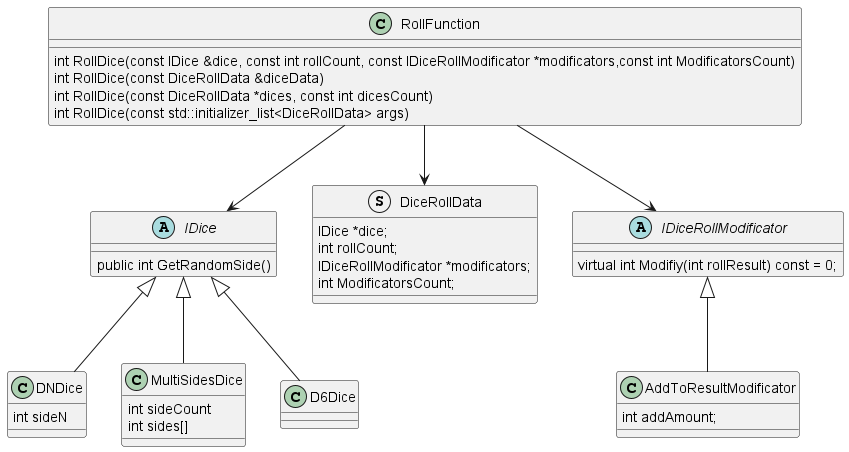
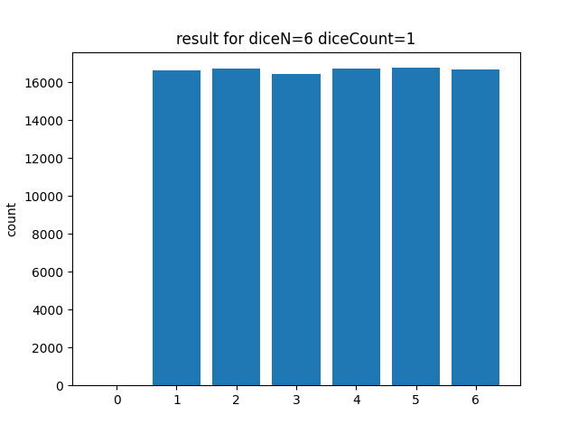
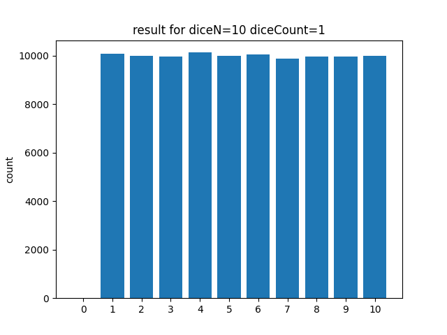
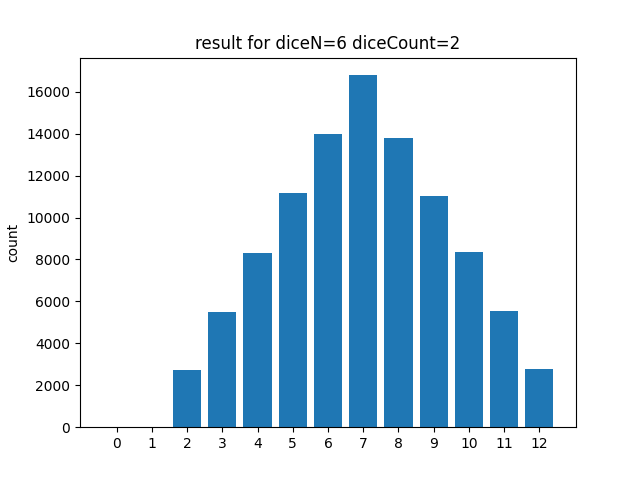
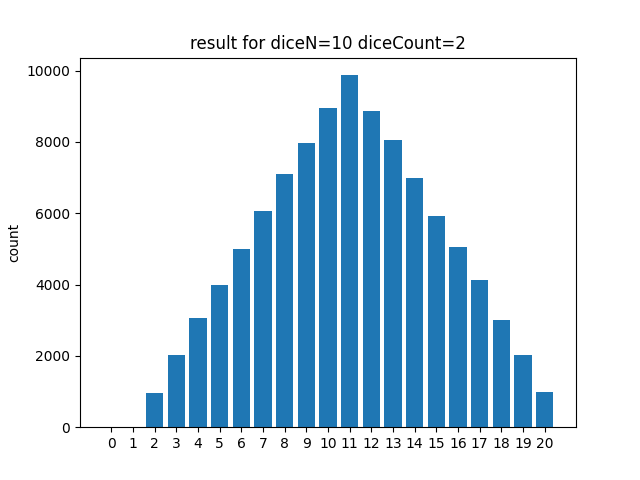
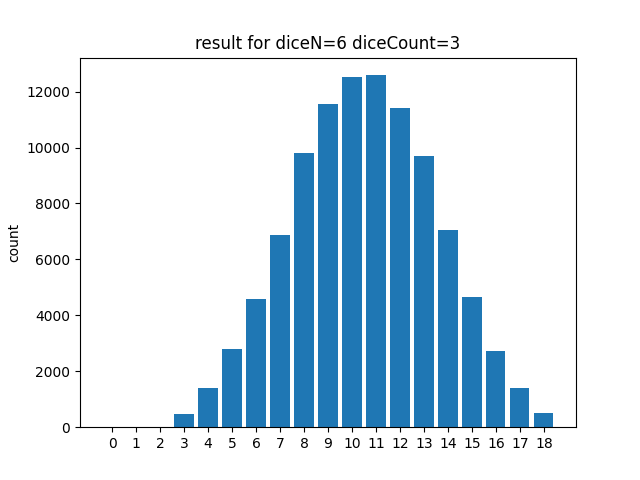
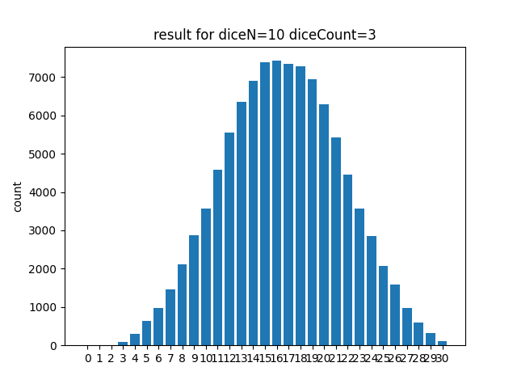

# ITMOGamedev2022_Algos_Lab4Dice

## Схема UML  

## Замеры, диаграммы

Результаты замеров d6 и d10

|         d6         |         d10          |
:------------------:|:--------------------:
  |  
  |   
  |   

- По диаграммам видно что у замеров 1d6 и 1d10 распределение равномерное, т.к чтобы получить каждый исход есть только один равновероятный вариант выпадения кубика.  
- а у 2d6 3d6 2d10 3d10 распределение нормальное, т.к у "серединных" исходов есть несколько вариантов получения из-за того что используется несколько кубиков

